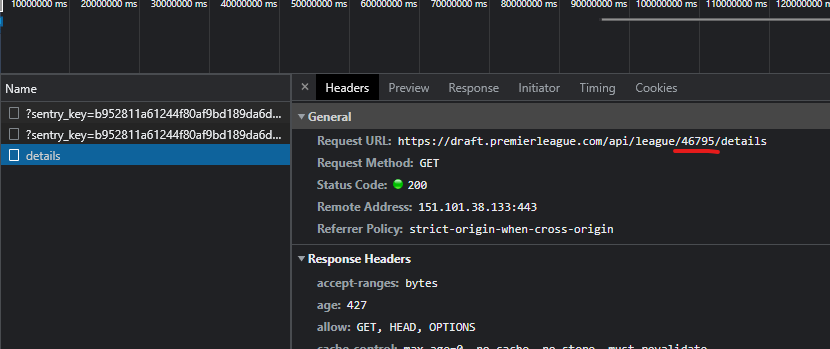

## ➤ Prerequisites

- [Node.js](https://nodejs.org/en/)

## ➤ Technology

This project uses the following technology

- [React](https://reactjs.org/) A JavaScript library for building user interfaces
- [Create React App](https://github.com/facebook/create-react-app) Create React apps with no build configuration.
- [Tailwindcss](https://tailwindcss.com) for a utility first CSS workflow.
- [Typescript](https://www.typescriptlang.org/) Types added to Javascript.
- [Chart.js](https://www.chartjs.org/) Charts
- [Cypress](https://www.cypress.io/) e2e tessting

## ➤ The Project

  This project displays variosu stats and info of a Head to head draft league in fantasy draft for the premier league> https://draft.premierleague.com/league
  It is written in typescript react and uses Tailwind for css.

## ➤ How to run

```bash
  cd .\api\  
  npm install
  node server.js
  cd ..
  cd .\my-app\ 
  npm install
  npm start
```

The project has 2 folders
Api and my-app. You have to run npm install in both folders.
In the api folder run the command node server.js. It should display this message in the console if it is working> Server is running on port 3001
Then run npm start in the App folder and navigate no http://localhost:3000/
You can use the league code 46795 to test.
If you have your own H2H draft league then you can find the id by inspecting the network tab on the fantasy premier league site. 
I did it by going to the Standings tab and refreshing. Then you should be able to see your league id in the network tab ( see picture)
  

The app only handles H2H leageus, there is still some work required ot handle non H2H draft leagues but the work for it is about 60% finished so it is disabled for now.

There was plan to do individual player stat pages but unfortunatly I didnt have the time. The pages exist but no data is displayed.

## ➤ Code

I used create react app to start the project but the rest of the code is mine.
Some of the css are from various tailwind sources.
The chart is made with chart.js. 
I spent the weekend on this project plus about 2 hours on monday on the readme and cleanup.

Most of the heavy lifting is done in the utils.tsx file. It analyzes the response from the fantasy api and creates intresting stats from it.
for example> 
  - Longest win,loss and undefeated streaks in the league
  - List of all the results for each player
  - line chart of leaguepoints and points over time and also ranking over time
  - ranking over time had to be figured out by analyzing the data as the current rank is the only thing the api returns
  - Highest and lowest scores in a week.

Things on the todo list I didnt have time to finish are>

  - individual player stats pages
  - better look for the scoring and streak content card
  - on hover for the matches in the match card
  - cypress tests.
  - last 5 games result in the table
  - better look for the charts in dark mode (also in general)

  ## ➤ External API

  The external api is the Fantasy premier league api. There is no documentation for it so in order to find the endpoints to use I had to inspect the network tab to
  see the api calls. It is an open API and many people have done something with it for the normal fantasy league. My project focuses on draft head to head leagues and
  displayes info about it not found on their website.

  ## ➤ Eslint

  IO used eslint and copy pasted the eslint.config I normally use in my job at the moment. There are probably things there that do no apply to this project.

    ## ➤ Testing

  IThere is a single e2e cypress test written. It test to see if the stats are rendered after entering the league id.
  To test use the command npm run cypress:open (while the project is running). That opens the cypress window where you can run the test

[](#dependencies)

## ➤ Dependencies

  * **"@types/node"**: "^16.18.26",
  * **"@types/react"**: "^18.2.6",
  * **"@types/react-dom"**: "^18.2.4",
  * **"autoprefixer"**: "^10.4.14",
  * **"axios"**: "^1.4.0",
  * **"chart.js"**: "^4.3.0",
  * **"postcss"**: "^8.4.23",
  * **"postcss-flexbugs-fixes"**: "^5.0.2",
  * **"react"**: "^18.2.0",
  * **"react-chartjs-2"**: "^5.2.0",
  * **"react-dom"**: "^18.2.0",
  * **"react-router"**: "^6.11.1",
  * **"react-router-dom"**: "^6.11.1",
  * **"react-scripts"**: "5.0.1",
  * **"tailwindcss"**: "^3.3.2"

  - dev dependencies

    * **"@typescript-eslint/eslint-plugin"**: "^5.59.2",
    * **"eslint"**: "^8.40.0",
    * **"eslint-config-airbnb"**: "^19.0.4",
    * **"eslint-config-standard-with-typescript"**: "^34.0.1",
    * **"eslint-plugin-import"**: "^2.27.5",
    * **"eslint-plugin-jsx-a11y"**: "^6.7.1",
    * **"eslint-plugin-n"**: "^15.7.0",
    * **"eslint-plugin-promise"**: "^6.1.1",
    * **"eslint-plugin-react"**: "^7.32.2",
    * **"eslint-plugin-react-hooks"**: "^4.6.0",
    * **"eslint-plugin-simple-import-sort"**: "^10.0.0",
    * **"tailwind-scrollbar"**: "^3.0.0",
    * **"typescript"**: "^4.5.4"
    * **"cypress"**: "^12.11.0",


League numbers> 48617

46765 46766